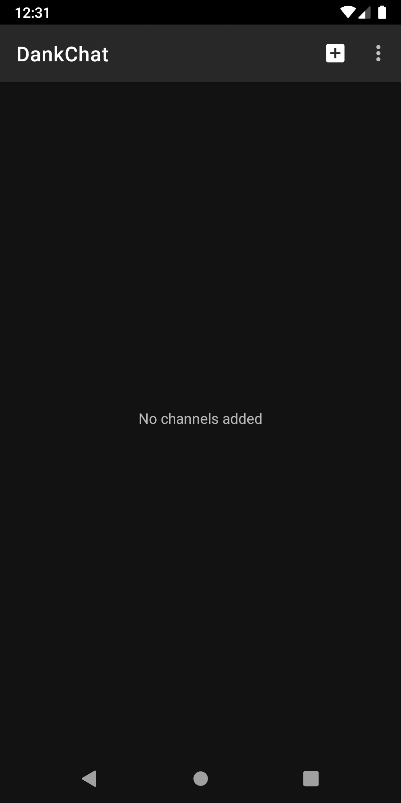
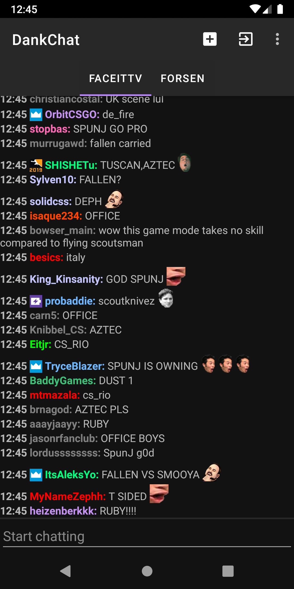

# DankChat   
  
Download the latest version manually: https://install.appcenter.ms/users/flex3r/apps/dankchat/distribution_groups/public  
Make sure to click "install anyway" when a Play Protect dialog shows during install.  
If you want to enable automatic updates inside the app, make sure to open the link on your phone and open the app immediately after installation. After a short redirect to the browser and back to the app, updates should be enabled.  

 
