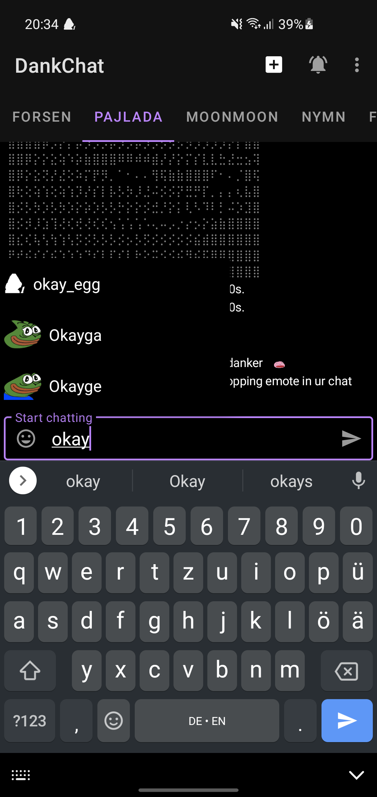

#  DankChat

  

  
A signed release version is available [here](https://github.com/flex3r/DankChat/releases/tag/release)  
Make sure to click "install anyway" when a Play Protect dialog pops up during installation.   

  

## Localization
DankChat uses crowdin for translations. Except for strings in the base language, resource strings don't need to be edited anymore.  
If you want to contribute, request access to be a translator here: https://crowdin.com/project/dankchat

## Donate
Support the DankChat development and get a dank badge next to your name  
https://streamelements.com/flex3rs/tip
