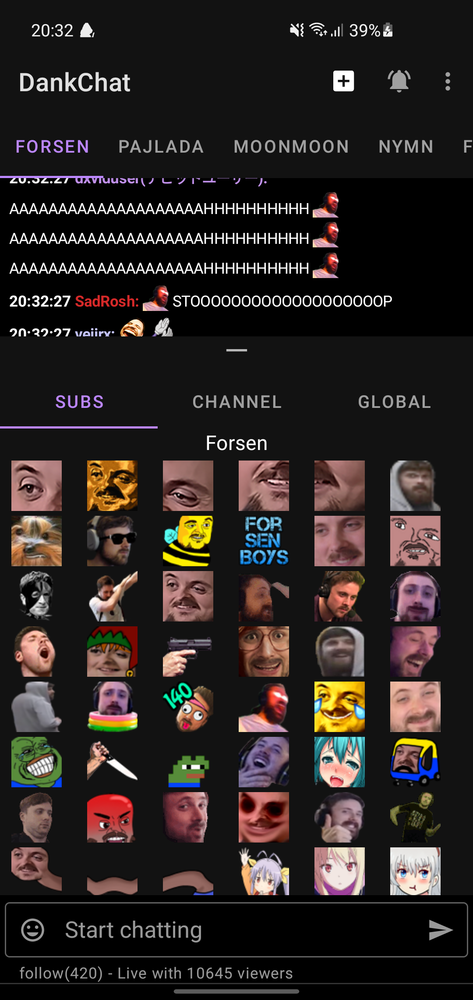
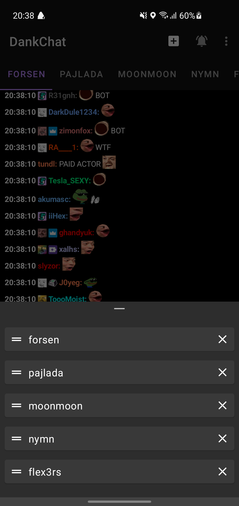

# DankChat   

  
Download the latest version manually: https://install.appcenter.ms/users/flex3r/apps/dankchat/distribution_groups/public  
Make sure to click "install anyway" when a Play Protect dialog shows during install.   

  
